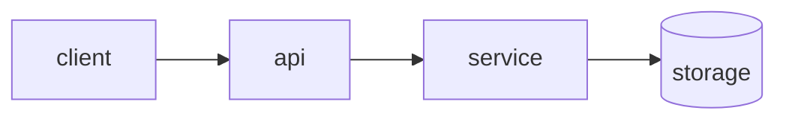

# Udistributed Ujob Uqueue — Design

## 1. Overview
What this is and the problem it solves.

## 2. Goals / Non-goals
- **Goals:**
- **Non-goals:**

## 3. Architecture

(Replace with the real component diagram + data flow.)

## 4. Data model
Key entities and relationships.

## 5. How this scales
Behavior at 10x / 100x; what becomes the bottleneck and the plan for it.

## 6. Failure modes
What breaks, how we detect it, how we recover.

## 7. Open questions
Decisions still to make (each becomes an ADR).
