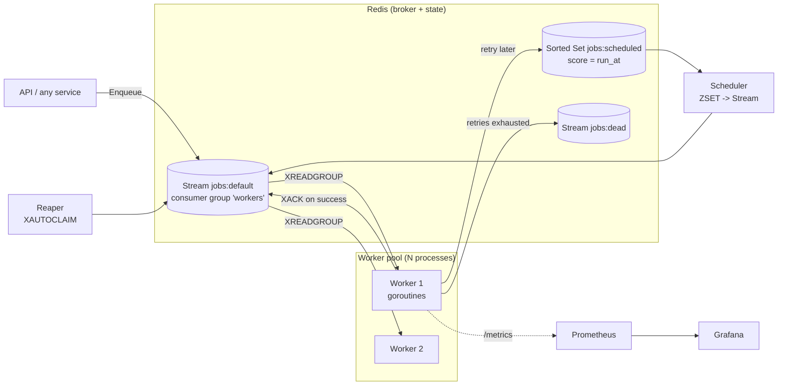

# Distributed Job Queue — Design

> Interview artifact. This is the document I'd walk a staff engineer through. It states what the
> system does, the decisions behind it, how it scales, and how it fails.

## 1. Overview

A background **job queue**: producers enqueue units of work (jobs); a pool of **workers** pulls
those jobs and executes them asynchronously, reliably, and at scale. Think Sidekiq (Ruby) or
Celery (Python) — but built in Go, on Redis, with reliability and observability as first-class
concerns.

**The problem it solves:** you don't want to do slow/failable work (send email, generate a PDF,
call a third-party API, run an AI inference) *inside* a web request. You hand it off, return to the
user immediately, and have it done reliably in the background — even if a worker crashes mid-job.

## 2. Goals / Non-goals

**Goals**
- Enqueue a job in O(1); workers process concurrently across many machines.
- **At-least-once delivery**: a job is never silently lost, even if a worker dies mid-execution.
- **Retries** with exponential backoff + jitter.
- **Dead-letter queue (DLQ)** for jobs that exhaust retries — nothing vanishes.
- **Delayed / scheduled jobs** ("run this in 10 minutes" / "at 3am").
- **Graceful shutdown**: a worker told to stop finishes in-flight jobs, acks them, then exits.
- **Recovery**: jobs claimed by a worker that then crashed get re-delivered to a healthy worker.
- **Observability**: queue depth, throughput, latency, retries, DLQ size as Prometheus metrics;
  structured logs; health endpoints.

**Non-goals (v1)**
- Exactly-once delivery (impossible in general; we get *effectively-once* via at-least-once +
  idempotent handlers — see §8).
- A web UI (Grafana is enough; a dashboard is a stretch goal).
- Cross-datacenter replication; strict priority fairness guarantees.

## 3. Architecture



**Components**
- **Client library** (`pkg/jobqueue`) — `Enqueue(ctx, job)` / `EnqueueIn(ctx, delay, job)`. What
  producers import.
- **Broker** — Redis. Holds the queue (a Stream), the scheduled set (a Sorted Set), the DLQ.
- **Worker** — a process running a pool of goroutines. Each pulls jobs via a Redis **consumer
  group**, runs the registered handler, acks. Owns retry/backoff/DLQ decisions.
- **Scheduler** — moves due delayed jobs from the sorted set into the live stream.
- **Reaper** — re-claims jobs stuck in the pending list of a dead worker.

## 4. Why Redis Streams (summary — full reasoning in ADR-0002)

A Redis **Stream** + **consumer group** gives us the two hard things a reliable queue needs:
1. **Acknowledgement** — a delivered job stays in a Pending Entries List (PEL) until the worker
   `XACK`s it. Crash before ack → the job is still pending, not lost.
2. **Recovery** — `XAUTOCLAIM` lets a healthy worker take over jobs a dead worker was holding.

A plain Redis List (`LPUSH`/`BRPOP`) can't do this: pop is destructive, so a crash after pop but
before completion loses the job. Streams are the right primitive. (Kafka / RabbitMQ / Postgres
weighed in ADR-0002.)

## 5. Data model (Redis keys)

| Key | Type | Purpose |
|---|---|---|
| `jobs:{queue}` | Stream | Live queue for a named queue (e.g. `jobs:default`). Consumer group `workers`. |
| `jobs:scheduled` | Sorted Set | Delayed jobs. member = job JSON, score = `run_at` (unix ms). |
| `jobs:dead` | Stream | Dead-letter queue: jobs that exhausted retries + failure metadata. |

**Job envelope (JSON stored in the stream entry field `data`):**
```json
{
  "id": "01J8X…ULID",
  "type": "send_email",
  "payload": { "to": "a@b.com", "template": "welcome" },
  "queue": "default",
  "attempt": 0,
  "max_retries": 5,
  "enqueued_at": "2026-09-05T12:00:00Z",
  "idempotency_key": "welcome-email-user-42"
}
```
`id` is a **ULID** — time-sortable, collision-resistant, needs no coordination.

## 6. Job lifecycle (state machine)

```
enqueued ──> (delayed? wait in ZSET) ──> ready (in stream)
   ready ──XREADGROUP──> in-flight (in worker's PEL)
in-flight ──success─────> XACK ──> done (removed)
in-flight ──fail, attempt<max──> XACK + re-enqueue w/ backoff (ZSET) ──> ready
in-flight ──fail, attempt=max──> XACK + push to DLQ ──> dead
in-flight ──worker dies──> stays in PEL ──reaper XAUTOCLAIM──> in-flight (new worker)
```
Note: on a retryable failure we `XACK` the original entry *and* re-enqueue a fresh copy with a
higher `attempt`. This keeps the PEL clean (the reaper only ever sees genuinely-stuck jobs).

## 7. Reliability mechanisms (the heart of the project)

- **At-least-once via consumer groups.** `XREADGROUP` delivers a job and records it in the PEL. We
  only `XACK` after the handler *succeeds*. Crash before ack → the job is re-deliverable.
- **Retries + exponential backoff + jitter.** On error, if `attempt < max_retries`, re-schedule at
  `now + base*2^attempt + rand_jitter`. Jitter prevents a synchronized retry storm.
- **Dead-letter queue.** At `attempt == max_retries`, push the job + error to `jobs:dead`.
  Operators inspect and re-drive. A poison job never blocks the queue.
- **Reaper for dead workers.** Each worker consumes under a unique consumer name; a crash leaves
  jobs in its PEL. A reaper loop runs `XAUTOCLAIM` to reassign entries idle past a threshold
  (~30s) to live workers. This is our **auto-recovery**.
- **Delayed jobs + scheduler.** `EnqueueIn` writes to the sorted set. A scheduler loop polls
  `ZRANGEBYSCORE 0 now` and atomically moves due jobs into the stream via a **Lua script**, so a
  crash mid-move never double-moves or loses a job.
- **Graceful shutdown.** On SIGTERM: stop pulling new jobs, let in-flight goroutines finish (with a
  deadline), ack what completes, then exit. Go primitives: cancel a `context.Context`, a
  `sync.WaitGroup` for in-flight jobs, `select` on `ctx.Done()` vs a timeout.
- **Idempotency (handler contract).** At-least-once means a handler CAN run twice (worker died
  after the side effect, before ack). Handlers should be idempotent; we offer an optional
  `idempotency_key` + a Redis `SET NX` dedup guard to make effectively-once easy.

## 8. Delivery semantics — the honest version

- **At-most-once** (plain LIST pop): fast, but loses jobs on crash. Rejected.
- **Exactly-once**: not achievable end-to-end — a worker can finish the side effect and die before
  acking; on redelivery it can't know it already ran unless the side effect itself is idempotent
  or transactional. "Exactly-once" is a marketing term.
- **What we build: at-least-once + idempotency = effectively-once.** What Sidekiq, SQS, and every
  serious queue actually do. Stating this plainly signals maturity in an interview.

## 9. Observability

- **Metrics (Prometheus):** `jobs_enqueued_total`, `jobs_processed_total{status}`,
  `job_duration_seconds` (histogram), `queue_depth{queue}` (gauge), `jobs_retried_total`,
  `dlq_size`. At `/metrics`.
- **Health:** `/healthz` (process alive), `/readyz` (Redis reachable).
- **Structured logs (JSON):** one line per job transition — `job_id`, `type`, `attempt`,
  `duration`, `error`.
- **Grafana dashboard:** throughput, p50/p95/p99 latency, queue depth, retry rate, DLQ size.

## 10. How this scales

- **Throughput:** add worker processes/machines — the consumer group load-balances stream entries
  across all consumers automatically. Near-linear until Redis is the bottleneck.
- **Redis ceiling (~100k+ ops/s):** pipeline commands, shard by queue across Redis instances, or
  isolate hot queues. Document this honestly.
- **Priorities:** one stream per named queue; workers weighted-poll high-priority queues first.
- **10x:** more workers. **100x:** shard Redis by queue; batch acks; consider Redis Cluster.

## 11. Failure modes

| Failure | Detection | Behavior |
|---|---|---|
| Worker crashes mid-job | Job idle in PEL | Reaper `XAUTOCLAIM` re-delivers |
| Handler throws | Handler returns error | Retry w/ backoff, then DLQ |
| Redis down | `/readyz` fails; enqueue errors | Producers get an error; workers back off + reconnect |
| Poison job (always fails) | Hits max_retries | Lands in DLQ, queue keeps flowing |
| Duplicate delivery | — | Idempotent handler / dedup key → no-op |
| Scheduler crash mid-move | Lua atomicity | Move is all-or-nothing; retried next tick |

## 12. Project layout (Go standard)

```
cmd/
  worker/main.go        # runs a worker pool
  enqueue/main.go       # CLI to enqueue a job (demo/testing)
internal/
  broker/               # Redis Streams ops (enqueue, read, ack, claim)
  worker/               # pool, handler registry, retry/backoff/DLQ logic
  scheduler/            # delayed-job mover (Lua)
  reaper/               # dead-worker recovery (XAUTOCLAIM)
  job/                  # Job envelope, ULID, (de)serialization
  metrics/              # Prometheus collectors
pkg/
  jobqueue/             # public client API: Enqueue, EnqueueIn, RegisterHandler
deploy/                 # Dockerfile, docker-compose.yml, k8s manifests
docs/ ...
```

## 13. Phased build plan (each phase demoable + committed)

1. **Vertical slice** — Job envelope + `Enqueue` to a stream + one worker that `XREADGROUP`s, runs
   a handler, and `XACK`s. Prove end-to-end with docker-compose (app + Redis).
2. **Concurrency** — worker pool of goroutines, graceful shutdown, context cancellation.
3. **Retries + backoff + DLQ.**
4. **Delayed jobs + scheduler** (Lua atomic move).
5. **Reaper** (XAUTOCLAIM dead-worker recovery).
6. **Observability** — Prometheus metrics, health endpoints, Grafana dashboard.
7. **Production infra** — multi-stage Dockerfile, compose stack, K8s manifests, CI/CD, load test.

## 14. Interview talking points (extend as we build)

- "Redis Streams consumer groups specifically for ack + PEL — a plain list can't recover a job
  from a crashed worker."
- "At-least-once with idempotency = effectively-once. Exactly-once end-to-end is a myth."
- "Dead-worker recovery is `XAUTOCLAIM` on entries idle past a threshold."
- "Backoff has jitter to avoid synchronized retry storms."
- "Bottleneck is Redis throughput; I'd shard by queue before reaching for Redis Cluster."
